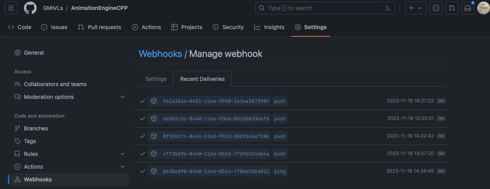
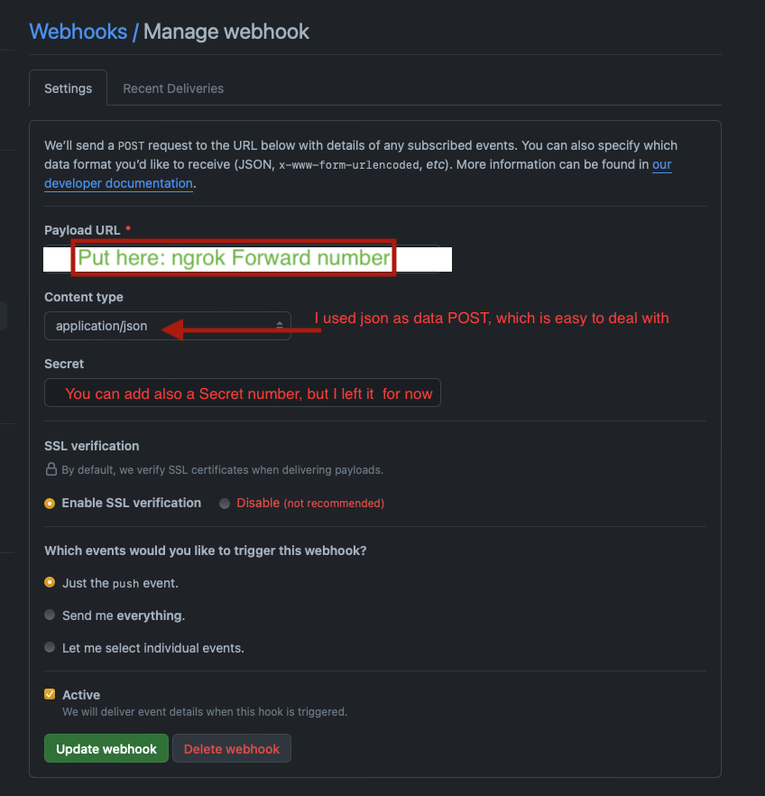

# AUTOMATIONSCRIPTPREPARATIONSTEPS

## 1. INSTALL THE NGROK SERVER

Following the steps [here](https://dashboard.ngrok.com/get-started/setup):

1. Download the ngrok binary and place it within your `ngrokServer` directory
   based on your machine
2. Run the authentication which will be genereate donly once, with a
   hash-authentication-key, as shwon in the website above.

```sh
./ngrokServer/ngrok config add-authtoken xxxxxxxxx-xxxxxxxxx-xxxxxxxxxxxx-xxxxxxxxx
```

- The results will be stored on my MBP, at

```sh
Authtoken saved to configuration file: /Users/<user_name>/Library/Application Support/ngrok/ngrok.yml
```

3. Run the ngrok server locally using, we will use the port `5000`, check if
   the port is available first.

```sh
# Original this is not working (ngrok http 5000), you must specify the localhost as 127.0.0.1, instead.
./ngrokServer/ngrok http 127.00.1:5000
```

4. You will get informations similar to below, we will keep the server open and
   just copy the `Forwarding` part.

```sh
ngrok

Introducing Pay-as-you-go pricing: https://ngrok.com/r/payg

Session Status                online
Account                       xxxxxxxxxxxxxx (Plan: Free)
Version                       3.4.0
Region                        country (country_init)
Latency                       xxms
Web Interface                 http://127.0.0.1:4040
Forwarding                    https://xxxx-xxxx-xxxx-xxxx-xxxx-xxxx-xxxx-xxxx-xxxx.ngrok-free.app -> http://xxx.0.0.1:5000

Connections                   ttl     opn     rt1     rt5     p50     p90
                              7       0       0.00    0.00    0.14    0.99
```

## 2. SETUP THE GITHUB WEBHOOK

5. Copy the
   `https://xxxx-xxxx-xxxx-xxxx-xxxx-xxxx-xxxx-xxxx-xxxx.ngrok-free.app` part
   to your GitHub webhook,

- **NOTE**, since this is a free paid version, this number will keep on
  changing everytime you close your `ngrok` server, so you have to always copy it
  manually and past it to the GitHub Webhook as we will show in next step.

6. Go to Github the specific repository and create a webhook as shown in the image below



- In the setting part I used



## 3. RUN THE FLASK SERVER LOCALLY

8. You will need to provide the Element message room details such as,

```sh
HOMESERVER    =  "xxxx-xxxx-xxxx-xxxx-xxxx-xxxx-xxxx-xxxx-xxxx"
ACCESS_TOKEN  =  "xxxxxxxxx-xxxxxxxxx-xxxxxxxxxxxx-xxxxxxxxx"
ROOM_ID       =  "xxxxxxxxx-xxxxxxxxx-xxxxxxxxxxxx-xxxxxxxxx"
```

- Finiding the homeserver: This the general Matrix server name
- Access_token: go to your `Element` app and search in the All_Setting->Help &
  About -> Advanced -> Access Token
- room_id: This can be found inside the room that you specify to send the
  message to, we can find the id at
  - Click on (...) infront your sepecified room => setting => Advanced => Room
    infomration => internal room ID

9. Now, you are ready to launch the flusk server.

```python
#pip install matrix-nio
python -m  src.S1localSever
```

## REFERENCES

- [How to get access token form element](https://webapps.stackexchange.com/questions/131056/how-to-get-an-access-token-for-element-riot-matrix)
- [setup ngrok server](https://dashboard.ngrok.com/get-started/setup)
